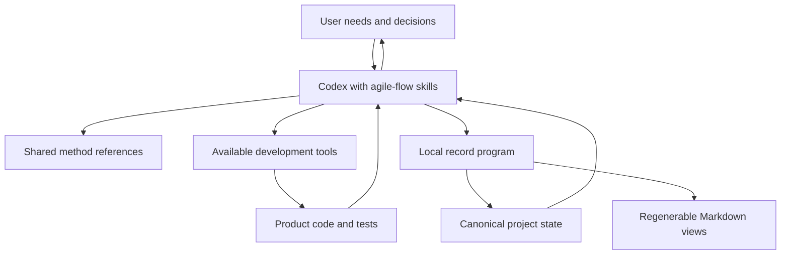

# agile-flow Plugin Design

**Date:** September 20, 2026.  
**Version:** First version, English language amendment.  
**Status:** Approved.  
**Approval:** The user approved this design on September 20, 2026, requiring English throughout the plugin, including document names and wording.  
**Product basis:** `docs/vision.md` and the approved `docs/functional-specification.md`. This document defines implementation design; it does not claim that the plugin has been built or installed.

## 1. Core Decision

agile-flow will be a Codex skills plugin with a small local record-management program. The agent interprets needs and develops software using available tools. The program maintains state and enforces rules that should not depend solely on narrative instructions.

The first version needs no MCP server, remote service, dedicated UI, hooks, or background execution. Official documentation supports packaging skills and resources in a plugin and using existing tools for workflows. This architecture is an agile-flow decision enabled by those capabilities, not a platform requirement. [OpenAI plugin architecture](https://developers.openai.com/plugins/concepts/plugins?site_locale=en).

The record program will use Python 3.11 or later and the standard library. It will not run product code, tests, or deployments; the agent performs those actions under Codex permissions. If no compatible interpreter exists, persistent operations report the missing requirement without claiming success or automatically installing dependencies.

## 2. Architecture and Responsibilities



| Component | Responsibility | Boundary |
| --- | --- | --- |
| Skills | Recognize intent, investigate, choose the next step, communicate results | Never fabricate evidence or authorization |
| Shared references | Define method, authorization rules, preparation, and review | Do not create a mandatory document chain |
| Record program | Validate inputs, relationships, transitions, revisions, and writes | Cannot itself prove user acceptance or that a test occurred |
| Canonical state | Preserve context, increments, decisions, evidence, and provenance | Does not replace code or grant environment permissions |
| Markdown views | Make vision references, backlog, status, and deliveries readable | Projections, not a second editable source of truth |

Semantic validity of evidence and authorization depends on the agent observing the actual source. The program checks structure and relationships; it does not authenticate conversations or certify software behavior.

## 3. Skills

Each skill has a `SKILL.md` with activation description, minimum inputs, procedure, continuation conditions, and output format. All read a common session reference before mutating records. These are approved design identifiers, not yet available commands.

| Skill | Intent | Outcome and continuation | Specification |
| --- | --- | --- | --- |
| `initialize` | Start a new project or adopt an existing one | Identified context, proportional diagnosis, references, initial proposal; retrieve an existing project | F01-F02 |
| `backlog` | Capture, refine, prioritize, or change needs | Deduplicated items and impact on active work; adding an idea does not start development | F03, F10 |
| `advance` | Prepare, develop, verify, or continue authorized work | Execute until delivery, a real blocker, or a necessary decision; present evidence | F04-F06, F09 |
| `review` | Accept delivery, request changes, and learn | Delivery-specific review, adjustments or new needs, concrete improvement when justified | F07-F08 |
| `status` | Inspect project and compare records with repository | Three-dimensional state, discrepancies, next step; read-only by default | F09 |
| `close` | Explicitly pause, cancel, close, or reopen | Administrative outcome and resumption point; preserve outstanding work | F10 |

Brief retrospection is integrated into `review` and can also be requested independently in natural language through that skill. Useful learning requires neither a periodic meeting nor an accepted increment.

There is not one skill per transition. `advance` can prepare, implement, and verify in one interaction when authorized. Reading another skill as intent changes does not create another agent.

Installation does not guarantee skill activation. Descriptions must recognize work intentions and support explicit invocation. Continuity is not promised in a new session where agile-flow is not activated. Integration validation covers explicit invocation and selection by intent.

## 4. Package Structure

```text
agile-flow/
  .codex-plugin/plugin.json
  skills/
    initialize/SKILL.md
    backlog/SKILL.md
    advance/SKILL.md
    review/SKILL.md
    status/SKILL.md
    close/SKILL.md
  references/
    session-protocol.md
    adaptive-method.md
    authorization.md
    readiness-and-quality.md
    review-and-learning.md
    record-contracts.md
  scripts/
    agile_flow.py
  tests/
    test_records.py
    test_transitions.py
    test_recovery.py
    scenarios/
  docs/
    vision.md
    functional-specification.md
    plugin-design.md
  README.md
```

The manifest identifies `agile-flow`, version, and skills directory. Metadata will be validated with local plugin-creation tools before distribution; absent components and resources are not declared.

Skills resolve scripts and references relative to their installed location, never through hard-coded personal paths. Plugin source stays in this project; product records belong to each product, not the installation or plugin cache.

Method references contain original instructions and attributed summaries. The source PDF remains project reference material and is excluded from the distributed package.

## 5. Records in Each Managed Project

Use `.agile-flow/` at the selected product root:

```text
product/
  .agile-flow/
    state.json
    state.backup.json
    views/
      summary.md
      backlog.md
      increments/
        INC-0001.md
    evidence/
      EVD-0001.txt
```

`state.json` is the sole canonical source for plugin-managed records. It includes current state and relevant operation history. History preserves field changes and reasons, not every agent thought or command. This avoids transactions across numerous documents without requiring a database or a separate event system.

Markdown views are generated on demand after a write or requested view update. They identify their source revision and generated status. If rendering fails, saved canonical state remains valid and stale views are identified. Do not claim a complete rollback when the canonical record was committed.

Existing vision and product documents remain in place and are referenced with a fingerprint and observation date. They are not relocated. A user-requested new vision document is authored and linked; its full content is not duplicated as another editable vision inside JSON.

Keeping this folder preserves records across sessions. Git versioning is optional; recording progress does not automatically create commits. Backups and temporary files are excluded from any proposed versioning. Evidence output is summarized and stripped of secrets before persistence.

JSON provides consistency at the cost of manual editing convenience. Users primarily interact through conversation, product documents, and views. Manual JSON or view edits are detected, preserved, and reconciled before replacement. Edits to a generated view are not treated as authorization instructions.

## 6. Data Contract

State includes `schema_version`, `revision`, project identity, quality policy, and collections with stable IDs. Timestamps are UTC. Authored records and views are English; conversational presentation can use the user's language and time zone when available. Product paths are relative to the root except explicit external references.

| Entity | Essential fields |
| --- | --- |
| Project | ID, name, vision/document references, constraints, administrative state, next step |
| Backlog `ITEM` | ID, type, purpose, provenance, decided or proposed priority, dependencies, known criteria |
| Increment `INC` | ID, linked items, objective, scope, exclusions, brief technical plan, criteria, required checks, authorization reference, states, delivery revision |
| Decision `DEC` | User/agent author, faithful text or summary, available source, date, reason, scope, superseded decision |
| Evidence `EVD` | Covered check and criteria, result, evaluated delivery, relevant file fingerprints, environment, limitations |
| Review `REV` | Delivery and parts evaluated, actual user decision, message reference, requested changes |
| Blocker `BLK` | Affected scope, condition, relevant attempts, resolution requirement, state |
| Improvement `IMP` | Observation, adjustment, applicable authorization, target cycle, effect evidence |

Readable prefixes such as `INC-0001` use counters allocated within protected writes. A project UUID is independent of name and absolute path; moving the project triggers location reconciliation without changing identity.

Conversation references use identifiers when available; otherwise retain a minimal relevant quote, author, and date. No history API is mandatory. Such records aid continuity and are not credentials for external actions. Original quotes remain verbatim, with English summaries separately labeled when needed.

A request may authorize multiple increments, each linked to it. Authorization limited to the current increment does not expand to the whole backlog. Revocation and subsequent changes prevail.

## 7. Writes, Idempotency, and Recovery

The program provides inspection operations (`inspect`, `validate`), view generation (`render`), and domain mutations (`initialize`, `update-backlog`, `prepare`, `start`, `record-evidence`, `record-review`, `record-decision`, `record-blocker`, `record-improvement`, `pause`, `close`, `reopen`). This is an internal interface; the user need not learn it. Rendering writes derived views but does not mutate canonical product state.

Mutation requests are JSON files or standard input, without interpolating user text into shell commands. Each includes operation ID, expected revision and state fingerprint, purpose, and required references. Results are `applied`, `already_applied`, `conflict`, or `failed`, with resulting revision and concrete errors.

Write protocol:

1. Read and validate state. An incompatible plugin version cannot modify a newer schema.
2. Acquire local mutual exclusion and reread the file. Use operating-system transaction locking on macOS/Linux; other platforms need an equivalent before compatibility is claimed.
3. Check operation ID, associated content, expected revision, and fingerprint. Reusing an ID with different content conflicts; repeating the same operation returns its previous result.
4. Validate relationships, referenced authorization, states, and active-work limit. Apply in memory and add the history entry.
5. Back up the previous valid state; write new JSON to a temporary file in the same directory, synchronize, and atomically replace the canonical file.
6. Read back and release the lock. If the response is lost after replacement, retrying the same ID retrieves the result without duplication.

The lock lasts for a transaction, not a development session. It prevents cooperating simultaneous writers but does not provide multi-agent coordination. External editors may ignore it: fingerprints detect changes before replacement but cannot guarantee protection from every simultaneous external write. Manual editing occurs while mutations are paused.

On corruption, preserve the damaged file, validate backup, and present recovery options. Never silently restore because recent decisions could be lost. Before replacement, failure leaves prior state intact; after an uncertain outcome, inspect before retrying.

For large evidence, write an immutable file before recording its fingerprint. Failure may leave an identified orphan, never a confirmed reference to a file not yet written. Small evidence summaries can be stored directly in state.

## 8. Coordination and States

All skills identify root and records, read applicable instructions, retrieve authorized scope, compare relevant state, interpret intent, then act or consult.

`status` reports discrepancies without writing by default. Before development, `advance` records necessary reconciliation to avoid knowingly stale state. A request to continue after a pause permits resumption within that request's scope.

| Rule | Design |
| --- | --- |
| One active increment | At most one unsuspended `in_progress` increment per project; blocking alone does not free the slot |
| Ready | Identified objective, scope, criteria, and checks; no unresolved product decision preventing execution |
| Start | Applicable authorization reference, readiness, and available active slot |
| Implemented | Changes completed; frees the slot even if acceptance is pending |
| Verification | Derived from required checks for the current delivery |
| Acceptance | Derived from explicit user reviews of the current delivery |
| Closure | Separate administrative state; never changes the three dimensions to manufacture completion |

Development values are `pending`, `preparing`, `ready`, `in_progress`, `implemented`, and `canceled`.

Verification values are `not_run`, `partial`, `failed`, and `passed`. Any current required failed check yields `failed`; all required checks passed yields `passed`; only some successfully executed yields `partial`; no current results yields `not_run`. Non-applicability requires recorded justification, not removal merely to obtain a pass.

Acceptance values are `not_requested`, `pending`, `changes_requested`, and `accepted`. Before presentation use `not_requested`; after presentation without sufficient response use `pending`; outstanding requested adjustments yield `changes_requested`; acceptance of all current parts yields `accepted`. Partial acceptance retains part-level detail without accepting the whole.

## 9. Deliveries and Evidence Validity

Each increment has delivery revisions. Evidence and acceptance reference a revision and scope. Global record revision also changes for administrative operations and does not itself invalidate the product.

Before verification, record the baseline: commit when available, relevant files and hashes, uncommitted changes, configuration, and environment necessary to interpret results. Git does not replace working-tree fingerprints. Without Git, use paths and hashes directly.

Before reusing evidence, compare the baseline. If a covered file or relevant dependency changes, retain the evidence as historical and reevaluate the check. When impact cannot be bounded, conservatively mark it pending. External files, services, and unobservable data are explicit verification limits.

Previous acceptance remains historical and is not automatically transferred to later functional changes. Administrative-only changes preserve delivery revision and acceptance. Independent components may retain partial acceptance only when unchanged scope is justified.

Example: `INC-0001` delivers password recovery. Its first revision passes unit tests but real delivery remains untested, so verification is partial. User acceptance can be recorded while the technical gap remains. Changing link behavior creates a new delivery revision and triggers reassessment of affected checks and acceptance.

## 10. Applying the Method Without Bureaucracy

Reference existing vision; a correction does not require writing a new one. A small increment's technical plan and criteria can be a few lines in its record. Views show the detail needed for review or resumption.

The backlog preserves purpose and priority without requiring points or unsupported time estimates. An investigation has an explicit question and limit. Retrospection produces an action only for identifiable learning. Do not create meetings, fictional human roles, or redundant approval stages.

A documentation-only request retains that scope and does not escalate to code execution. Skill selection follows current intent and authorization rather than a rigid sequence.

## 11. Installation and Operating Limits

Validate the first implementation in local Codex with repository access and compatible Python. No external accounts, dedicated API keys, or database are required. Installation and marketplace details are resolved at packaging time; design approval does not publish anything or change Codex configuration.

Uninstalling or updating must not delete `.agile-flow/`. Each version validates `schema_version`; future migrations require backup and a reviewable proposal. Forward compatibility is not promised.

There is no monitoring between turns or guaranteed persistence after an unexpected interruption before the next checkpoint. Record meaningful milestones before and after relevant actions. On resumption, compare the repository to reconstruct observed progress while distinguishing it from previously recorded evidence.

## 12. Planned Validation

Validate deterministic behavior separately from agent behavior:

- Record program: invalid transitions, missing references, two active increments, repeated operations, conflicts, lost responses, interrupted writes, recovery, verification states, and partial acceptance.
- Evidence: uncommitted changes, no Git, administrative revisions, and behavior changes; only current evidence remains applicable.
- Skills: new and existing projects, history-free resumption, read-only status, documentation-only requests, new scope, existing authorization, blockers, and applied learning.
- Package: manifest, names, relative references, scripts accessible from another working directory, and installation in a new session; explicit invocation and intent-based selection.
- Language: English plugin-owned filenames, prose, examples, code identifiers, diagnostics, templates, state values, and generated summaries; preservation of original quoted evidence and existing product content. Non-English user requests still map to the correct intent.

Program tests alone do not establish methodological compliance. Codex scenarios inspect outputs and records, including the absence of invented consent or unexecuted tests claimed as successful.

| Approved capabilities | Design owners |
| --- | --- |
| F01-F02 | `initialize`, root identification, existing references |
| F03 | `backlog`, stable IDs, provenance, priority decisions |
| F04-F06 | `advance`, readiness/start rules, checks, delivery revisions |
| F07-F08 | `review`, scoped acceptance, adjustments, improvements |
| F09 | `status`, selective reading, repository comparison |
| F10 | `close`, administrative suspension/closure, reprioritization through `backlog` |
| Persistence and autonomy | Record program, shared protocol, decision sources |

## 13. Approved Design Decisions

The user approved six skills, Python without additional dependencies, one record folder per product, and a single canonical JSON file with Markdown views, with the English-language amendment documented below.

A single JSON file grows with history and is inconvenient to edit manually. For this local first version it avoids cross-file inconsistencies; agent-facing reads filter by active state and increment. If usage shows size is a problem, design a migration before splitting records or adopting a database.

This is a design deliverable. Executable skills, project records, manifest, and installation have not been created.

## 14. English-Language Policy

English is the authoritative language for all plugin-owned material: names, filenames, skill descriptions and instructions, references, docs, templates, schemas, enum values, code identifiers and comments, diagnostics, tests, examples, generated views, and authored record summaries.

The user may submit requests and converse in their preferred language. Translate their intent into English records faithfully. Preserve verbatim source text, quoted approvals, command output, external documents, and existing product identifiers; use explicitly labeled English summaries where needed. This exception preserves evidence and does not authorize rewriting the user's product or translating the source book.

Approved names:

| Area | English names |
| --- | --- |
| Skills | `initialize`, `backlog`, `advance`, `review`, `status`, `close` |
| Product documents | `vision.md`, `functional-specification.md`, `plugin-design.md` |
| Shared references | `session-protocol.md`, `adaptive-method.md`, `authorization.md`, `readiness-and-quality.md`, `review-and-learning.md`, `record-contracts.md` |
| Views | `summary.md`, `backlog.md`, `increments/` |

The language choice is the user's product requirement. This document makes no universal claim about English's token efficiency or comprehension advantage across models and tasks.

## 15. Sources and Document Provenance

- Product basis: approved `docs/functional-specification.md` and `docs/vision.md` in agile-flow.
- Packaging capabilities consulted September 20, 2026: [official plugin architecture](https://developers.openai.com/plugins/concepts/plugins?site_locale=en).
- Local manifest and validation contract: the available `plugin-creator` skill. Revalidate the effective schema when building the package.
- The root-level `functional-specification.md` is an English translation of an earlier draft copy. The approved specification in `docs/` is authoritative; the earlier copy remains explicitly superseded.
- Language amendment and design approval: user instruction on September 20, 2026. Original source PDF remains unchanged and is not included in the distributable plugin.

## Collaboration outcome amendment

The collaboration flow is shared by all six skills through `references/collaboration-flow.md`. Each stage produces a reviewable outcome, not merely a record mutation. This replaces the assumption that a valid record alone demonstrates useful product understanding.

New generated views `vision.md` and `preparation.md` expose product synthesis and a non-executable preparation proposal. The latter is stored in optional `project.preparation`; it is distinct from an authorized increment and cannot grant authorization. Existing state files remain readable without migration. Optional `users`, `confirmed_facts`, and `proposals` distinguish audience, sourced facts, and suggestions from assumptions.

An authored vision remains in its existing location. The generated synthesis does not replace or duplicate the full authored document. A project AGENTS.md is optional and remains a place for repository-specific conventions. It is not required to orchestrate the plugin.

Backlog views include criteria, uncertainty, dependencies, priority reasoning, and provenance; increment views include exclusions, technical plans, checks, and authorization references. Manual-view protection also applies to the new views. Conversation-level scenarios complement persistence tests and must be reported separately from automated validation.
